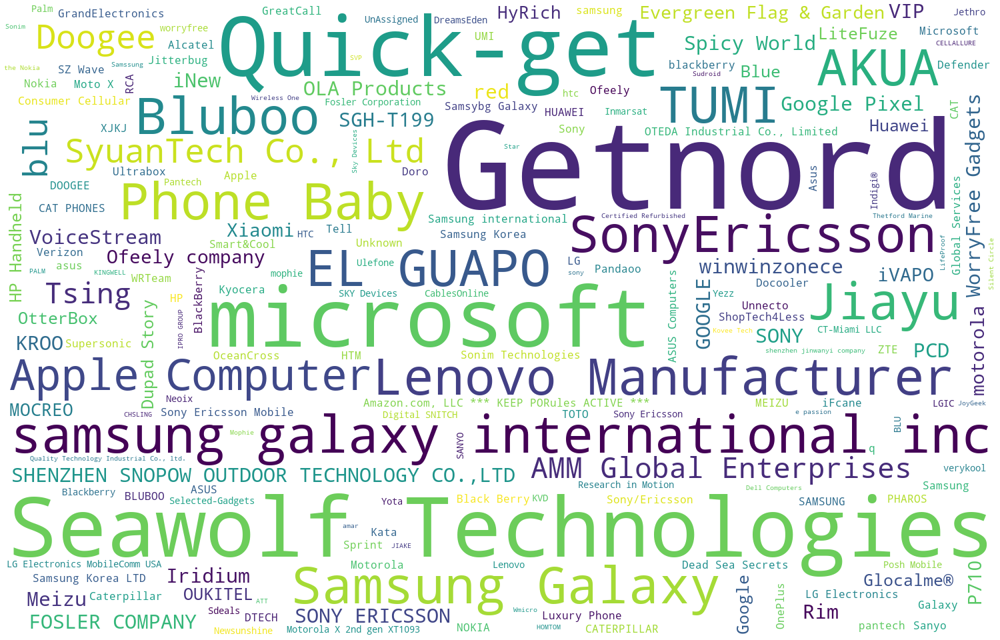

# Mobile-Phone-Review-Project

- Used Pyspark to analyze 400k customer reviews of mobile phones sold on Amazon to predict items rating to prevent fake reviews and conducted Text Mining including text cleaning, topic modeling, feature extraction.  

- Cleaned unstructured text data by handling missing values and categorical data, processed segmentation, and transformed data from text into numeric using TF-IDF and Word2vec.

- Trained multiple models through data pipeline including: Decision Tree, Naives Bayes, and Logistic Regression to predict rating based on reviews and evaluated models by AUROC and F1 score.  

